<div align="center">

# F1 PIXEL CUP

**THE 2025 GRID. EVERY 2025 CIRCUIT. IN YOUR BROWSER.**

<a href="https://f1-pixel-cup.vercel.app/play.html"></a>


<a href="LICENSE"></a>
<br/>


**[f1-pixel-cup.vercel.app](https://f1-pixel-cup.vercel.app)**

</div>

---

<p align="center">
  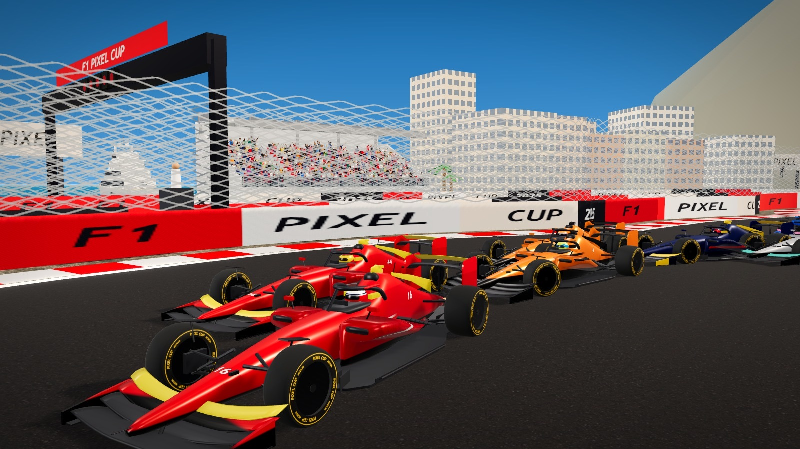
</p>

<p align="center"><em>Monaco, the harbour front. Leclerc's Ferrari leads Hamilton's, with Norris, Piastri, Verstappen and Russell queued up behind. Yachts at the quay, the crowd in the stands, the start gantry overhead.</em></p>

<p align="center">
<a href="#what-this-is">What this is</a> ·
<a href="#gallery">Gallery</a> ·
<a href="#features">Features</a> ·
<a href="#how-to-play">How to play</a> ·
<a href="#the-grid">The grid</a> ·
<a href="#the-circuits">The circuits</a> ·
<a href="#cups-seasons-and-your-own-way">Cups and seasons</a> ·
<a href="#race-day">Race day</a> ·
<a href="#controls">Controls</a> ·
<a href="#the-honest-physics">Honest physics</a> ·
<a href="#under-the-hood">Under the hood</a> ·
<a href="#how-it-came-together">How it came together</a> ·
<a href="#credits-and-licences">Credits</a>
</p>

---

## What this is

**An F1 racing game that runs in a browser tab, with nothing to install.** Pick any of the 20 drivers from the 2025 season, climb into their team's car and race the other nineteen on real circuits: all 24 of the 2025 calendar, plus eight legends that F1 has left behind.

It is F1 with a Mario Kart heart. The circuits are traced from their real outlines, most pit lanes are where OpenStreetMap puts them, it rains at Spa about as often as it really does, and the scoring is 25, 18, 15. But the races are five laps, item boxes sit on the straights and a blue shell (here, a Steward Penalty) can still ruin the leader's afternoon.

Then the TV bit: replays from four broadcast cameras; a 3D podium where the top three, each with their own face, take their steps, the winner lifts the trophy and the champagne goes everywhere; and a second player on the same keyboard if you want a fight.

> [!TIP]
> Fastest way in: open **[f1-pixel-cup.vercel.app/play.html](https://f1-pixel-cup.vercel.app/play.html)**, press **Enter** and you're on the grid of the Opening Cup as Charles Leclerc. `W A S D` to drive, `Space` to fire whatever the box gave you.

---

## Gallery

Every picture here comes from the game's own renderer in a 1600x900 window, taken by [`tools/capture-shots.js`](tools/capture-shots.js) (its `readme` part). Some are posed like a photo: a real race, paused, with the named cars placed on the road and a camera set by hand. The others are the game as it plays (the rain shot with its HUD hidden).

<table>
<tr>
<td width="50%">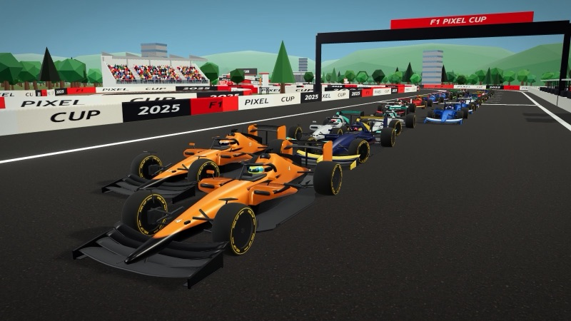</td>
<td width="50%">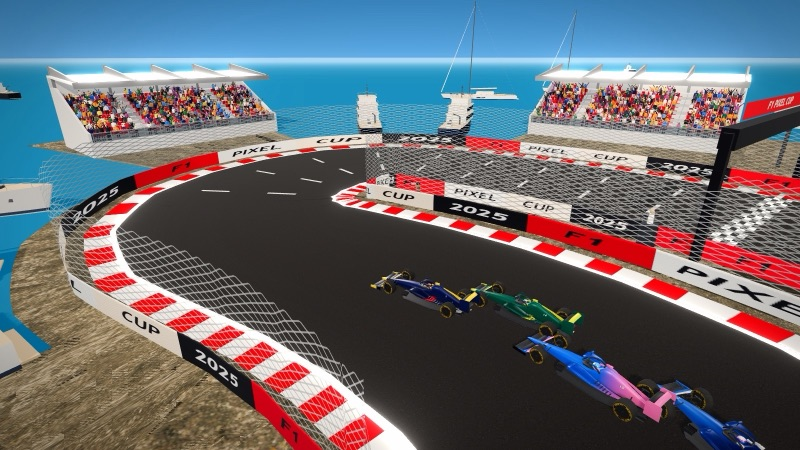</td>
</tr>
<tr>
<td><em><b>The cars.</b> Suzuka's main straight: Norris and Piastri, then Verstappen, Antonelli and Russell. One Blender-built 2025-shape car, painted in each team's scheme.</em></td>
<td><em><b>Monaco's harbour.</b> Stands full of 3D spectators, the sea behind, yachts moored stern to the quay. Verstappen, Alonso, Gasly and Albon below.</em></td>
</tr>
<tr>
<td width="50%">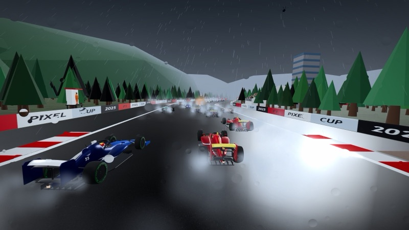</td>
<td width="50%">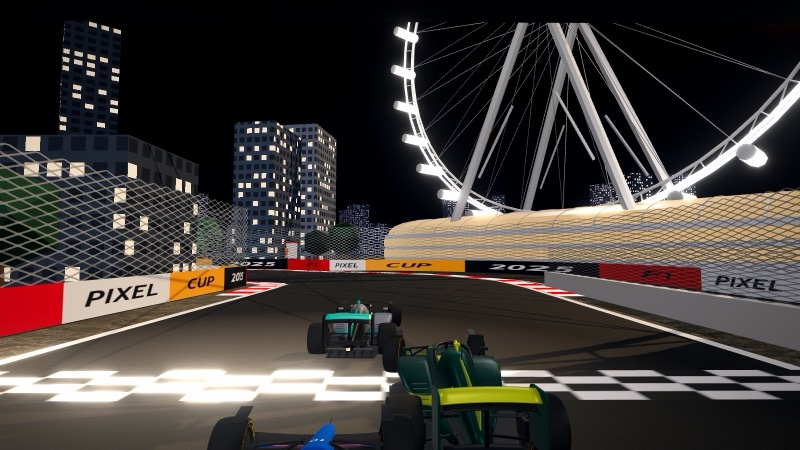</td>
</tr>
<tr>
<td><em><b>Rain.</b> Spa in the wet with Hamilton: spray off every car, drops on the lens, green intermediates on the wheels and less grip everywhere.</em></td>
<td><em><b>Night races.</b> Singapore under the lights, the Flyer lit up over the start line. Russell's Mercedes and Alonso's Aston Martin.</em></td>
</tr>
<tr>
<td width="50%">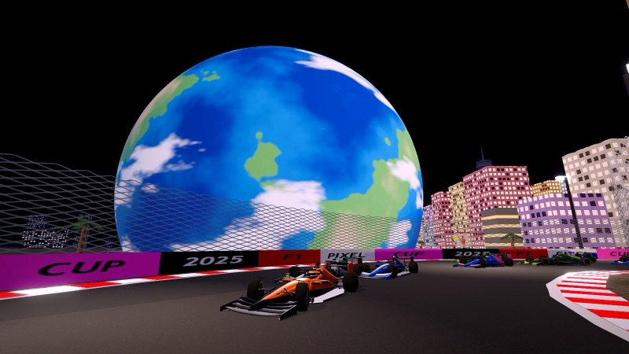</td>
<td width="50%">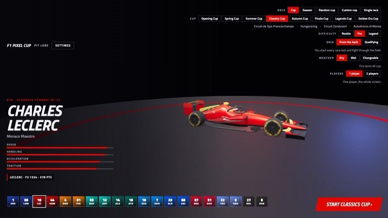</td>
</tr>
<tr>
<td><em><b>Landmarks.</b> Piastri past the Sphere on the Las Vegas Strip, with Antonelli and Sainz behind. Every 2025 venue has its own set piece, from the Sphere to Suzuka's Ferris wheel.</em></td>
<td><em><b>The pit lane.</b> Pick the race, the difficulty, the grid and the weather; pick your driver; their car turns on the showroom floor.</em></td>
</tr>
<tr>
<td width="50%">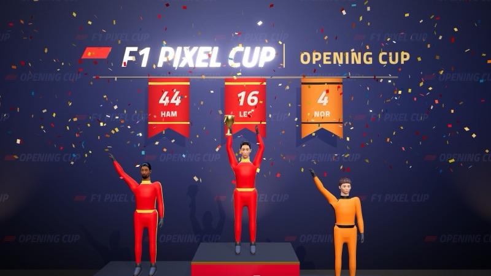</td>
<td width="50%">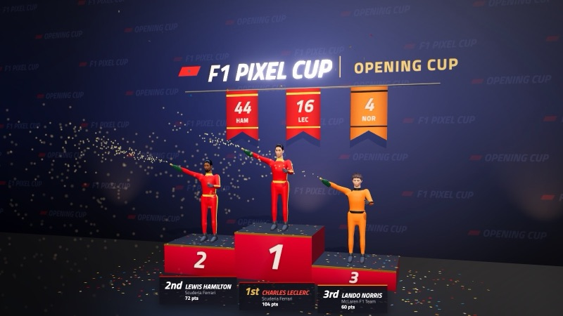</td>
</tr>
<tr>
<td><em><b>The podium.</b> The camera pushes in as Leclerc lifts the trophy, Hamilton and Norris waving either side. Each driver has their own face.</em></td>
<td><em><b>...and the champagne.</b> Spray, confetti, name plates with the cup's points, banners in team colours.</em></td>
</tr>
<tr>
<td width="50%">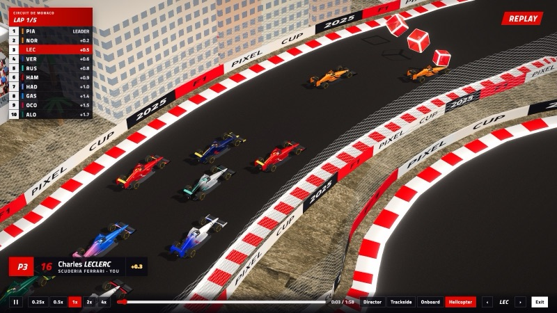</td>
<td width="50%">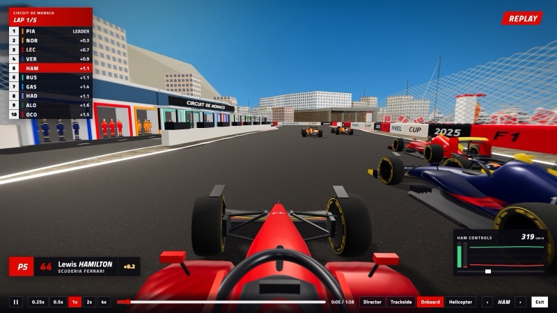</td>
</tr>
<tr>
<td><em><b>Replays: the helicopter.</b> A whole race recorded, played back with a timing tower and a lower-third, here over Monaco following Leclerc.</em></td>
<td><em><b>Replays: onboard.</b> Hamilton's T-cam, with his throttle, brake and steering drawn live in the corner.</em></td>
</tr>
<tr>
<td width="50%">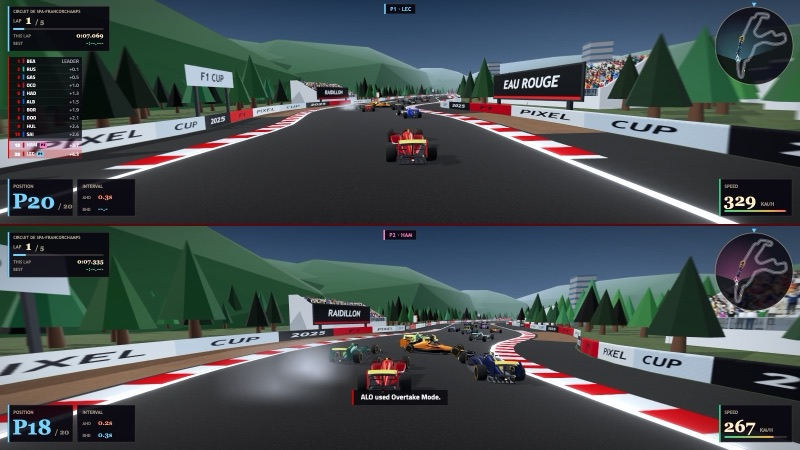</td>
<td width="50%">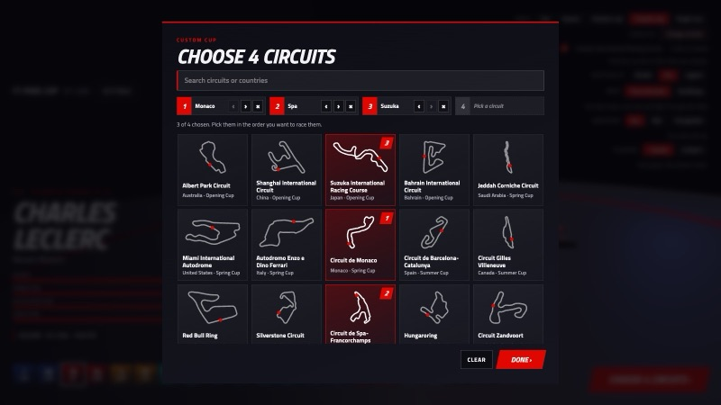</td>
</tr>
<tr>
<td><em><b>Two players.</b> Split screen at Spa: Leclerc on top, Hamilton below, each with their own HUD and mini map.</em></td>
<td><em><b>Your own cup.</b> The circuit picker: any four of the 32, in the order you choose. Monaco, Spa, Suzuka and one to go.</em></td>
</tr>
</table>

---

## Features

<table>
<tr>
<td width="33%" valign="top">🏁 <b>32 real circuits</b><br/><sub>All 24 of 2025 in calendar order, plus 8 historic ones. Real outlines, real pit lanes, named corners.</sub></td>
<td width="33%" valign="top">🏎️ <b>The 2025 grid</b><br/><sub>20 drivers, 10 teams, each car in its team's paint with its driver's number and helmet.</sub></td>
<td width="33%" valign="top">🏆 <b>8 cups and a season</b><br/><sub>Six calendar cups, two historic cups and the full 24-race 2025 Season, saved after every race.</sub></td>
</tr>
<tr>
<td width="33%" valign="top">🎲 <b>Race your way</b><br/><sub>A random cup, a custom cup of any four circuits, or a single race.</sub></td>
<td width="33%" valign="top">🌧️ <b>Weather</b><br/><sub>Dry, Wet, or Changeable: each circuit rains as often as it really does.</sub></td>
<td width="33%" valign="top">🍌 <b>8 power-ups</b><br/><sub>F1 ideas with Mario Kart counterparts, from an Oil Slick to the Safety Car.</sub></td>
</tr>
<tr>
<td width="33%" valign="top">🎥 <b>TV replays</b><br/><sub>Director, Trackside, Onboard and Helicopter cameras, 0.25x to 4x, with broadcast graphics.</sub></td>
<td width="33%" valign="top">🥂 <b>A 3D podium</b><br/><sub>The top three with their own faces: arms up, the trophy, the champagne.</sub></td>
<td width="33%" valign="top">🎮 <b>Two players</b><br/><sub>Split screen on one keyboard or two gamepads, stacked or side by side.</sub></td>
</tr>
<tr>
<td width="33%" valign="top">🏟️ <b>Trackside life</b><br/><sub>Stands and 3D crowds at every venue, marshals with flags, a TV helicopter, fireworks at the flag.</sub></td>
<td width="33%" valign="top">📈 <b>A career per driver</b><br/><sub>Points, an Elo-style rating from Karting to World Champion, poles, wins and best laps.</sub></td>
<td width="33%" valign="top">🔊 <b>All sound synthesised</b><br/><sub>Engine, tyres, crowd, rain and the start lights, made live with WebAudio. No audio files.</sub></td>
</tr>
</table>

---

## How to play

1. **Open the game** at [f1-pixel-cup.vercel.app/play.html](https://f1-pixel-cup.vercel.app/play.html) (or from the site's front page).
2. **Pick a driver** with `←` `→` or a click. Leclerc is already picked.
3. **Choose the race**: a cup, the season, a random or custom cup, or a single race. Set the difficulty (Rookie, Pro, Legend), the grid and the weather.
4. **Press Enter.** Five red lights, then lights out.
5. **Drive.** Hold `Shift` through a corner to charge a drift boost (the smoke turns white, blue, then orange as it charges), let go for the kick. Drive through the red boxes for a power-up; `Space` uses it.
6. **Five laps later** the whole field finishes the distance, the results come up, and you can **Watch the replay**. After the last race of a cup, the season or a single race: the podium.

> [!NOTE]
> The game is driven with a keyboard or a gamepad. On a phone or tablet it says so, and that touch controls are on the way.

---

## The grid

Twenty drivers, ten teams, the 2025 line-ups. Pick a driver and you race their team's car, in its colours, with their number on the nose and engine cover and their own helmet design in the cockpit.

| Team | Car | Drivers |
|---|---|---|
| **Ferrari** | SF-25 | **16** Charles Leclerc · **44** Lewis Hamilton |
| **McLaren** | MCL39 | **4** Lando Norris · **81** Oscar Piastri |
| **Red Bull** | RB21 | **1** Max Verstappen · **30** Liam Lawson |
| **Mercedes** | W16 | **63** George Russell · **12** Kimi Antonelli |
| **Aston Martin** | AMR25 | **14** Fernando Alonso · **18** Lance Stroll |
| **Alpine** | A525 | **10** Pierre Gasly · **7** Jack Doohan |
| **Williams** | FW47 | **23** Alex Albon · **55** Carlos Sainz |
| **Haas** | VF-25 | **87** Oliver Bearman · **31** Esteban Ocon |
| **Racing Bulls** | VCARB 02 | **22** Yuki Tsunoda · **6** Isack Hadjar |
| **Sauber** | C45 | **27** Nico Hülkenberg · **5** Gabriel Bortoleto |

---

## The circuits

All 32, at one scale, five laps each. 🌙 marks the night races, under floodlights; the rain column is how often Changeable weather turns wet there.

| | Circuit | Lap | Rain | What's there |
|---|---|---|---|---|
| 1 | Albert Park, Australia | 5.278 km | 20% | Melbourne's skyline over the lake |
| 2 | Shanghai, China | 5.451 km | 30% | The snail at turns 1 and 2, as tight as the real one, and its grandstand |
| 3 | Suzuka, Japan | 5.807 km | 30% | The figure of eight on its bridge, and the Ferris wheel |
| 4 | Bahrain | 5.412 km | 2% | Desert twilight under floodlights, the Sakhir tower, heat haze |
| 5 | Jeddah, Saudi Arabia 🌙 | 6.175 km | 2% | The fountain, yachts out at sea |
| 6 | Miami, United States | 5.412 km | 15% | The stadium |
| 7 | Imola, Italy | 4.909 km | 30% | The hillside at Tosa; Tamburello, Piratella and Rivazza on their boards |
| 8 | Monaco | 3.337 km | 15% | The casino, the tunnel, the harbour full of yachts |
| 9 | Barcelona, Spain | 4.655 km | 10% | Its grandstand |
| 10 | Montréal, Canada | 4.361 km | 30% | The Biosphère |
| 11 | Red Bull Ring, Austria | 4.318 km | 30% | The Spielberg grandstand and the hillside |
| 12 | Silverstone, Great Britain | 5.891 km | 35% | The Wing |
| 13 | Spa-Francorchamps, Belgium | 7.004 km | 50% | Eau Rouge and Raidillon, the Ardennes forest, the pits |
| 14 | Hungaroring, Hungary | 4.381 km | 20% | The hillside |
| 15 | Zandvoort, Netherlands | 4.259 km | 30% | The Hugenholtz terraces |
| 16 | Monza, Italy | 5.793 km | 15% | The old banking |
| 17 | Baku, Azerbaijan | 6.003 km | 5% | The Flame Towers, the old city, yachts |
| 18 | Singapore 🌙 | 4.928 km | 25% | Marina Bay Sands, the Flyer, yachts on the bay |
| 19 | Circuit of the Americas, United States | 5.514 km | 10% | The tower and the hill up to Turn 1 |
| 20 | Mexico City | 4.304 km | 15% | Foro Sol |
| 21 | Interlagos, Brazil | 4.309 km | 40% | São Paulo's towers and the lake |
| 22 | Las Vegas, United States 🌙 | 6.201 km | 2% | The Sphere and the Strip |
| 23 | Lusail, Qatar 🌙 | 5.380 km | 2% | Its grandstand and Lusail's towers |
| 24 | Yas Marina, Abu Dhabi 🌙 | 5.281 km | 2% | The Yas hotel, yachts in the marina |
| 🕰️ | Hockenheimring, Germany | 4.574 km | 25% | The Rhine plain's pine forest |
| 🕰️ | Nürburgring, Germany | 5.148 km | 40% | Dark Eifel forest on rolling hills |
| 🕰️ | Estoril, Portugal | 4.182 km | 15% | Pines on the hills, the Atlantic to the south |
| 🕰️ | Kyalami, South Africa | 4.529 km | 15% | The Highveld's dry grass and acacias, Johannesburg on the horizon |
| 🕰️ | Sepang, Malaysia | 5.543 km | 45% | Oil palms everywhere |
| 🕰️ | Istanbul Park, Türkiye | 5.338 km | 15% | Dry hills and scrub |
| 🕰️ | Mugello, Italy | 5.245 km | 15% | A Tuscan valley of cypresses and olive groves |
| 🕰️ | Watkins Glen, United States | 5.430 km | 30% | The Finger Lakes' woods in autumn colours |

Every circuit has its pit lane and garages, stands and a crowd, marshal posts and a TV helicopter, and its own ground, sky, colour grade and trees or city. The landmarks are the 2025 venues'; the historic circuits have their stands, crowds and their own country's ground, trees and sky, but no landmark yet.

> [!NOTE]
> **Where the pits are.** Where OpenStreetMap maps the real pit lane, the game's sits beside it, on its real side. Three don't: at Interlagos the real lane leaves the track through the Senna S and at Singapore its side bends too tightly for garages, so theirs are across the road, and Monaco's is placed by hand. Albert Park, Monza, Suzuka and Las Vegas have none mapped, so theirs come from the circuit's shape.

---

## Cups, seasons and your own way

### The race choices

| Choice | What you race |
|---|---|
| **Cup** | One of eight four-race cups (below). |
| **Season** | The **2025 Season**: all 24 races in calendar order, for the drivers' and the constructors' titles. Saved after every race and resumed from the pit lane, ties broken on countback. One player. |
| **Random cup** | Four circuits drawn from all 32, no repeats. Don't like the draw? Reroll. |
| **Custom cup** | Any four circuits, in the order you choose, from a picker you can search. |
| **Single race** | One circuit, chosen or drawn at random. |

### The cups

| Cup | Races |
|---|---|
| **Opening Cup** | Albert Park · Shanghai · Suzuka · Bahrain |
| **Spring Cup** | Jeddah · Miami · Imola · Monaco |
| **Summer Cup** | Barcelona · Montréal · Red Bull Ring · Silverstone |
| **Classics Cup** | Spa-Francorchamps · Hungaroring · Zandvoort · Monza |
| **Autumn Cup** | Baku · Singapore · Circuit of the Americas · Mexico City |
| **Finale Cup** | Interlagos · Las Vegas · Lusail · Yas Marina |
| **Legends Cup** 🕰️ | Hockenheimring · Nürburgring · Estoril · Kyalami |
| **Golden Era Cup** 🕰️ | Sepang · Istanbul Park · Mugello · Watkins Glen |

The 2025 grid races the historic circuits too. Each is the layout its outline data holds, and the game says which: Hockenheim is the short Grand Prix circuit raced from 2002 to 2019, the Nürburgring the Grand Prix circuit of 2002 to 2020, Sepang the F1 circuit of 1999 to 2017, Istanbul Park as raced in 2005 to 2011 and 2020 to 2021, Mugello as raced in 2020, and Watkins Glen the long circuit with the Boot, close to its F1 layout of 1975 to 1980; Estoril and Kyalami are today's circuits, not the ones F1 raced.

### The settings that change a race

- **Difficulty:** Rookie, Pro (the default) or Legend. What changes is how the CPU drivers drive (how far ahead they look, how close to the limit they corner, how tidy their line is, how often they make a mistake) and a pace factor; [the physics section](#the-honest-physics) has the numbers.
- **Grid:** *From the back* (the default, Mario Kart style: you start last and the CPU cars line up by the cup standings, leader on pole) or *Qualifying*: one flying lap from a rolling start, every CPU lap simulated with the same physics.
- **Weather:** *Dry*, *Wet* (every race) or *Changeable*, where each race rolls once against how often it really rains there: Spa one race in two, Sepang, Interlagos and the Nürburgring nearly as often, the desert races almost never.
- **Scoring:** 25, 18, 15, 12, 10, 8, 6, 4, 2, 1, and a point for the fastest lap if you finish in the top ten.

### Your career

Every driver keeps their own career, saved in the browser. **Career points** only go up: the race's F1 points, a cup bonus of 50, 30 or 20 for the top three and points for qualifying, all times the difficulty (Rookie x1, Pro x2, Legend x3). The **rating** goes up and down: it starts at 1200 and moves Elo-style against a field of fixed strength for each difficulty, through the tiers Karting, F4, F3, F2, F1 and World Champion (1850 and up). Best laps, poles, wins and the race history are kept too.

### The power-ups

The item you get depends on how far you are behind the leader, not your place, with Mario Kart 8 Deluxe's shape of odds: the weak items are common and the strong ones rare (and none of the three strongest in the first fifteen seconds).

| Item | Mario Kart | What it does |
|---|---|---|
| **Oil Slick** | Banana | Drop it behind you, or hold `Space` to trail it, where it blocks one Undercut or Debris from behind. |
| **Debris** | Green shell | Fired straight ahead; bounces off the track's edges for six seconds. |
| **DRS** | Mushroom | The rear wing's flap really opens: two seconds of boost, three on a straight. |
| **Undercut** | Red shell | Follows the track round the corners to the car ahead and spins it. |
| **Overtake Mode** | Star | Five seconds faster and untouchable; cars you touch spin. |
| **Steward Penalty** | Blue shell | Flies over the field to the leader: a long spin for them and anyone beside them. |
| **Formation Lap** | Bullet Bill | Four seconds of autopilot at huge speed along the racing line. |
| **Safety Car** | Lightning | Out ahead of the leader for five seconds; every rival is slowed to its pace. You aren't. |

Shots, oil and the safety car move along the track itself, so they follow every corner and never meet a car on the other level of Suzuka's crossover.

---

## Race day

**The replays.** Every race is recorded at 30 samples a second, so when the results come up you can **Watch the replay** from four cameras: *Trackside* (TV cameras round the lap that pan and zoom after the car, then cut to the next), *Onboard* (the T-cam, with that driver's throttle, brake and steering drawn live), *Helicopter*, and the *Director*, who opens on the leader from the air, then cuts every six seconds between Trackside, Onboard and Helicopter shots, following the closest battle in the top six (or you, when there isn't one). The broadcast graphics come along: a timing tower, a lower-third with the car in view, and a scrubber from 0.25x to 4x.

**The podium.** After a cup, the season or a single race, the top three stand on their steps in 3D. The camera sweeps in, the arms go up (third, then second, then first, each stepping forward), the camera pushes in on the winner lifting the trophy, then the champagne (on Medium and High graphics) and the confetti, and a slow orbit for as long as you want to watch. The name plates carry the points and the banners the team colours.

**Two players.** Turn on *2 players* in the pit lane, pick P2's driver (it can't be P1's), and both of you race the same field, each with your own view, HUD, mini map and career. Each view keeps a sensible shape on any window: stacked on a normal screen, side by side on an ultrawide.

---

## Controls

### One player

| Action | Keys |
|---|---|
| Throttle | `W` or `↑` |
| Brake, then reverse | `S` or `↓` |
| Steer | `A` `D` or `←` `→` |
| Drift (charge a boost) | hold `Shift` while turning |
| Use the power-up | `Space` (Oil Slick: tap to drop, hold to trail) |
| Pause | `Esc` or `P` |
| Quit while paused | `Q` (after the flag, `Q` keeps your result) |
| Next race, or from qualifying to the race | `Enter` |
| Back to the pit lane from results or the podium | `Esc` |
| In the pit lane: change driver, start | `←` `→`, `Enter` |

### Two players

| | Throttle | Brake | Steer | Drift | Power-up |
|---|---|---|---|---|---|
| **P1** | `W` | `S` | `A` `D` | Left `Shift` | `Space` |
| **P2** | `↑` | `↓` | `←` `→` | Right `Shift` | `/` (left of Right `Shift`) |

Keys are read by position, and the pit lane labels them for your keyboard layout (AZERTY shows `Z Q S D`). The two views stack one above the other, or sit side by side once the window is more than 2.1 times as wide as it is tall.

### Gamepads

The first pad is P1's, the second P2's (standard mapping), and a pad and the keys work together.

| Action | Pad |
|---|---|
| Steer | left stick or d-pad |
| Throttle | right trigger or the bottom face button |
| Brake and reverse | left trigger or the right face button |
| Drift | either bumper |
| Power-up | the left or top face button |
| Pause | Start |

### Replays

| Action | Keys |
|---|---|
| Play or pause | `Space` |
| Back or forward 5 s | `←` `→` |
| Previous or next car | `↑` `↓` |
| Slower or faster (0.25x to 4x) | `-`, `=` (or `+`) |
| Next camera | `C` |
| Leave the replay | `X` or `Esc` |

---

## The honest physics

It's an arcade game, and it says where.

- **A fixed 60 Hz step.** The physics runs in steps of exactly 1/60 s (up to eight a frame), and drawing happens between them, so the game drives the same at 60 Hz and 144 Hz. The race clock is the physics' own time: it advances exactly as far as the physics does and stops while you're paused.
- **Not identical cars.** Every car runs the same physics code, but its numbers come from its team and its driver (speed, handling, acceleration, traction), so a Red Bull is not a Sauber. The pit lane shows the bars.
- **CPU drivers brake like drivers.** They look down the road, work out how fast their car can take what's coming and brake for it (`racecraft.js`). They also steer round traffic, which your own hands do for you.
- **Difficulty, in numbers.** Rookie CPU cars run at 90% pace, Pro at 100%, Legend at 105%. There is catch-up, and it's in the open: on Rookie a CPU car's pace moves up to 12% with its gap to you (quicker behind, slower ahead), on Pro up to 5%, and on Legend not at all.
- **Rain is real grip.** In the wet a car has 72% of its dry cornering grip, 85% of its traction and 75% of its braking, oil spins last longer and sliding tyres scrub. Under Monaco's tunnel roof the road stays dry.
- **Same scale everywhere,** so Spa is the longest lap and Monaco the shortest. But for the size of its cars the road is wider than a real one: corners tighter than it can turn are opened out, and stretches that would overlap once widened are nudged apart. Shanghai's snail is the exception: there the road narrows to half its width so the loops can come as close as the real ones.
- **Suzuka really crosses itself,** on a bridge, and each car only looks for road near where it already is, so nobody snaps across the crossover or cuts between two stretches side by side.
- **Nothing over the track, ever.** Every stand, tree, tower, yacht and hill checks its whole footprint against the circuit before it's placed, and `Render3D.auditScenery` drops rays right across the road and run-off all the way round each lap. Every circuit comes back with zero hits.

---

## Under the hood

```
play.html          the game, full window          index.html      the website (no 3D, loads fast)
game.js            physics, AI, laps, items, audio, HUD and the pit-lane flow
render3d.js, r3d/  the three.js renderer: car, track, landmarks, trackside, people,
                   rain, post-processing, the podium, replays' cameras
*.js (pure)        UMD modules tested in Node: weather, racecraft, grid, season, career,
                   choices, replay, ceremony, faces, twoplayer, powerups, pitlane, venue...
tracks-data.js     the 32 circuits, generated by tools/tracks/
assets/            Blender-built GLBs (car, driver, items, landmarks, people, yachts), textures
tools/blender/     the build scripts for every model, headless and self-checking
tools/checks/      the browser checks          tests/      the Node tests
```

- **No build step.** Plain scripts and one ES module renderer on [three.js](https://threejs.org) r186 (vendored, loaded through an import map), and a 2D canvas over the top for the HUD. If WebGL isn't there, the original 2D renderer takes over.
- **Built in Blender, from code.** The car, the driver figure, the power-up models, the landmarks, the grandstands, the crowd and crews, and the yachts are all generated by Python scripts in `tools/blender/`, run headless (`Blender -b --factory-startup -P <script>`). Each script checks its own result and refuses to write a broken model; the trackside models are compressed with meshopt.
- **Faces without photos.** The drivers' heads are MakeHuman's CC0 base mesh with its shape targets baked into shape keys. Each driver's look (shape sliders from a set of about forty, hair, beard, brows, eye and skin colour) is data in `game-data.js`; hair and beards are shells of fur. Public photos were used as reference only.
- **Circuits from open data.** Outlines from [bacinger/f1-circuits](https://github.com/bacinger/f1-circuits) and pit lanes, the Monaco and Silverstone start lines, the Monaco tunnel and the named corners from OpenStreetMap, through `tools/tracks/fetch_osm.py` and `build_tracks.py`.
- **Shaders compile behind the loading panel.** `Render3D.prepare()` builds each circuit, compiles every shader and uploads every texture before the countdown, so the first frame never stalls. Graphics run on three tiers (High, Medium, Low) with Auto picking one and stepping down if the first seconds run slow.
- **Checked twice.** `npm test` runs 399 Node tests (scoring, odds, weather, grids, the season, replays, the ceremony's timeline, faces, the circuits' data...). Then 26 browser checks in `tools/checks/` drive the real game in Playwright at real window sizes: every power-up, the season's save and resume, the podium, the replays, split screen, nothing over the track on every circuit, the view filling any window with no black bars. `tools/checks/run-all.js` runs them all against the dev server; its header shows how.

### Run it yourself

```bash
git clone https://github.com/AllStreets/F1PixelCup.git
cd F1PixelCup
python3 tools/dev-server.py .      # http://localhost:8765, caching off
npm test                           # Node 22, no dependencies to install
```

It has to be served over HTTP (the renderer is an ES module and loads models), so opening `play.html` from disk falls back to the 2D renderer. Any static server works.

<details>
<summary><b>Deploying, and retaking these pictures</b></summary>

<br/>

**Live:** https://f1-pixel-cup.vercel.app. The Vercel project follows this repo: every push to `main` deploys, other branches get preview URLs, and `.vercelignore` keeps `docs/`, `tests/` and `tools/` out of the upload.

**The README's pictures** come from `tools/capture-shots.js` with `globalThis.CAPTURE_PARTS = ["readme"]` against the dev server (`globalThis.README_ONLY` retakes just some: `hero`, `harbour`, `cars`, `night`, `sphere`, `rain`, `replay`, `podium`, `split`, and `pitlane`, which takes the picker too). They're written full size to `docs/readme/`, then sized for GitHub with `sips -s formatOptions 80 hero.jpg`, `sips -Z 1200 -s formatOptions 80` for `pitlane.jpg` and `picker.jpg` (so their text stays readable) and `sips -Z 800 -s formatOptions 78` for the rest. The website's own pictures are the script's other parts; its header lists them.

</details>

---

## How it came together

It didn't start in 3D. It started as a pixel-art kart racer with a pseudo-3D road drawn on a canvas, which is where the name comes from (and that view is still there, as the fallback when WebGL isn't available).

| When | What arrived |
|---|---|
| **Apr 2026** · *pixels* | A Mario Kart clone becomes F1 Pixel Cup 2025: the 2025 grid in pixel-art cars, F1 power-ups and F1 points, on eight hand-drawn tracks named after real circuits. |
| **Sep 7** · *a real race* | One chase camera, the heading-up mini map and the race HUD, five-lap races, sound, difficulties, a whole field that finishes the distance. |
| **Sep 27** · *3D, and a website* | The race moves to three.js with a Blender-built car, onto the real circuits, with landmarks and liveries, and scenery that never touches the track. Career scoring, and the website. |
| **Sep 28** · *power-ups and qualifying* | The eight F1 power-ups rebuilt to follow the track, a real Safety Car and DRS flap, real race times, qualifying and a difficulty that changes the field. |
| **Sep 29 to 30** · *a world* | A career per driver, the power-ups' beauty pass, painted helmets, the 2025 grid's pages on the site, broadcast post-processing, pit lanes from OpenStreetMap, marshals and the helicopter, rain with real wet grip, car v2 and the Blender driver figure. |
| **Oct 1 to 2** · *race day* | TV-camera replays, the 3D podium ceremony and two-player split screen. |
| **Oct 4 to 5** · *the whole calendar* | The drivers' own faces; landmarks, yachts, stands and 3D crowds at every venue; all 24 circuits of 2025 in six cups and the Season; random, custom and single races; the Legends and Golden Era cups. Then this README. |

### What's next

- [ ] **Accounts,** so a career follows you from one browser to another.
- [ ] **Touch controls** for phones and tablets.

---

## Credits and licences

| What | From | Licence |
|---|---|---|
| Circuit outlines | [bacinger/f1-circuits](https://github.com/bacinger/f1-circuits) | MIT |
| Pit lanes, the Monaco and Silverstone start lines, the Monaco tunnel, corner names, the Las Vegas Strip's buildings | [© OpenStreetMap contributors](https://www.openstreetmap.org/copyright) | ODbL |
| The website's race data (the drivers' and teams' pages) | [F1DB](https://github.com/f1db/f1db) by Marcel Overdijk | CC BY 4.0 |
| Ground textures | [Poly Haven](https://polyhaven.com) | CC0 |
| The drivers' heads (base mesh and shape targets, data only) | [MakeHuman](https://github.com/makehumancommunity/makehuman) | CC0 |
| 3D engine | [three.js](https://github.com/mrdoob/three.js) | MIT |
| Model decompression | [meshoptimizer](https://github.com/zeux/meshoptimizer)'s decoder, shipped with three.js | MIT |
| Typeface | [Titillium Web](https://fonts.google.com/specimen/Titillium+Web), from Google Fonts | SIL OFL 1.1 |

The game's own code is released under the [MIT License](LICENSE). The pieces above keep their own licences, and the notices for those shipped here are in [THIRD-PARTY-NOTICES](THIRD-PARTY-NOTICES).

F1 Pixel Cup is a fan-made game. It isn't affiliated with Formula 1, the FIA or any team, and it carries no official logos or sponsor marks: the names on the cars are the drivers', and the paint is each team's colours.
